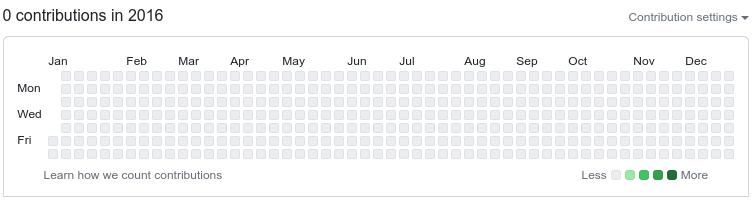

# Coding is life

Draw on your yearly github/gitlab contributions activity board.

This is just an fun project it occurred to me while looking at my empty github
contributions activity at the start of the year as if it was a blank canvas.

You can specify any text you'd like to be displayed on your github/gitlab
contributions activity page.

Additionaly, if you modify the source file and don't pass any message, you can
also draw anything you'd like.

You can write any message you'd like.

"Coding is life" with a left2right gradient:


Before it was just an empty canvas:


You can adjust number of commits. Take into account github/gitlab might take a
while to populate the changes to your activity.

## IMPORTANT

This repository overwrites its own history.

This repository has been generated running this command:

```sh
$ python coding-is-life.py -y 2016 --commit --gradient left2right -m "coding is life"
```

And then, just for reference:

```sh
$ git remote add origin git@github.com:pausan/coding-is-life.git
$ git push --set-upstream origin master --force
```

## MIT License

Copyright (c) 2024 Pau Sanchez

Permission is hereby granted, free of charge, to any person obtaining a copy
of this software and associated documentation files (the "Software"), to deal
in the Software without restriction, including without limitation the rights
to use, copy, modify, merge, publish, distribute, sublicense, and/or sell
copies of the Software, and to permit persons to whom the Software is
furnished to do so, subject to the following conditions:

The above copyright notice and this permission notice shall be included in all
copies or substantial portions of the Software.

THE SOFTWARE IS PROVIDED "AS IS", WITHOUT WARRANTY OF ANY KIND, EXPRESS OR
IMPLIED, INCLUDING BUT NOT LIMITED TO THE WARRANTIES OF MERCHANTABILITY,
FITNESS FOR A PARTICULAR PURPOSE AND NONINFRINGEMENT. IN NO EVENT SHALL THE
AUTHORS OR COPYRIGHT HOLDERS BE LIABLE FOR ANY CLAIM, DAMAGES OR OTHER
LIABILITY, WHETHER IN AN ACTION OF CONTRACT, TORT OR OTHERWISE, ARISING FROM,
OUT OF OR IN CONNECTION WITH THE SOFTWARE OR THE USE OR OTHER DEALINGS IN THE
SOFTWARE.